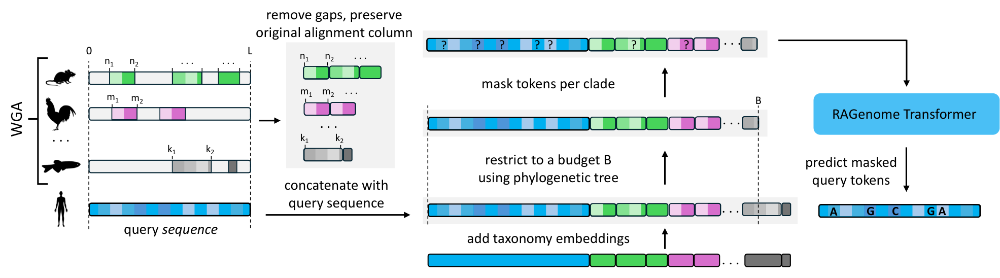
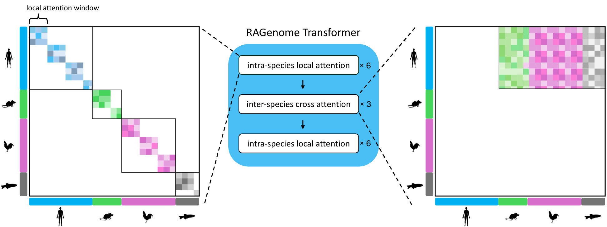

# RAGenome: Scaling Retrieval-Based Genomic Language Models to Long Contexts

RAGenome is a retrieval-based gLM that scales pretraining to longer context windows through an efficient retrieval mechanism. For each query sequence, RAGenome retrieves homologous sequences from a whole-genome alignment (WGA), removes gap tokens while keeping each token's original alignment column and restricts retrieval to a fixed token budget using the phylogenetic tree.



## Table of contents

- [Abstract](#abstract)
- [Architecture](#architecture)
- [Pretrained model](#pretrained-model)
- [Installation](#installation)
- [Training Data](#training-data)
- [Training](#training)
- [Get in touch](#get-in-touch)

## Abstract
The genome holds the blueprint that governs the biological properties of the cell. Consequently, advancing our knowledge of genomic function is crucial both for a broader understanding of biology and for continued biomedical advances. The success of large language models on natural language and protein sequences has motivated similar efforts on genomic data. However, standard genomic language models (gLMs) often require extremely large computational resources and still fall behind traditional methods on some downstream tasks. Recently, MSA-based pretraining has been proposed as an efficient alternative, but existing models are limited to short input contexts, restricting their use to short-range tasks, such as variant effect prediction. In this work, we present RAGenome, the first retrieval-based gLM that scales pretraining to longer contexts (100x longer than existing MSA-based gLMs), allowing it to capture both across-species evolutionary relationships and within-species longer-range interactions. Trained on whole-genome alignments from 100 vertebrates, RAGenome substantially improves the long-range capabilities of MSA-based gLMs, raising gene finding performance from 0.45 to 0.60, while remaining competitive on purely evolutionary-based tasks like prioritizing pathogenic variants. RAGenome provides competitive gLM performance at a fraction of the training cost, unifying evolutionary modeling and long-range capabilities within a single, flexible, scalable framework.

## Architecture



The RAGenome Transformer is a multi-head transformer where standard self-attention layers are replaced with two types of attention layers tailored to capture within-species and cross-species
dependencies: intra-species local attention (block-diagonal, each
species attends only within itself) and inter-species cross-attention (the query attends globally
over all retrieved species).

## Pretrained model

Pre-trained checkpoint of RAGenome is released on Hugging Face at
[`pantoniadis/RAGenome`](https://huggingface.co/pantoniadis/RAGenome).

```python
from transformers import AutoModel

model = AutoModel.from_pretrained("pantoniadis/RAGenome", trust_remote_code=True)
```

> [!TIP]
> Always pass retrieved homologous sequences to `model.forward(...)`. The pretrained model was trained with retrieval present, and performance depends heavily on it: see Figure 7 in the supplementary material.

## Installation

Clone the repository:

```bash
git clone https://github.com/PanosAntoniadis/RAGenome.git
cd RAGenome
```

Create an environment and install the package:

```bash
conda create -n ragenome python=3.11
conda activate ragenome
pip install torch==2.7.0 --extra-index-url https://download.pytorch.org/whl/cu126
pip install -e .
pip install flash-attn==2.8.3.post1 --no-build-isolation     # GPU + matching CUDA toolkit required
export RAGENOME_DATA_DIR=/path/to/data                       
export RAGENOME_LOG_DIR=/path/to/runs                        
```

## Training Data

All training data are publicly available and should be placed under `$RAGENOME_DATA_DIR`:

1. **Human Genome** (`genomes/hg38_softmasked.fa`): Download the soft-masked hg38 assembly from [here](https://hgdownload.soe.ucsc.edu/goldenPath/hg38/bigZips/hg38.fa.gz).
2. **Whole-Genome Alignment** (`msa/99.zarr/`): The 100-way multiz alignment released with GPN-MSA in [`songlab/multiz100way-pigz`](https://huggingface.co/datasets/songlab/multiz100way-pigz).
3. **Conservation scores** (`conservation/hg38.phastCons100way.bw`): Download them from [`here`](https://hgdownload.soe.ucsc.edu/goldenPath/hg38/phastCons100way/hg38.phastCons100way.bw).
4. **Species metadata** (`metadata/`, already included in this repository):
   * `clades.json`: the phylogenetic clades of the 100 alignment species from GPN-Star.
   * `species_lineages/species.txt`: the alignment species in column order (column 0 is human).
   * `species_lineages/common_to_scientific.json`: assembly name to scientific name.
   * `species_lineages/species_lineages.json`: the NCBI taxonomic lineage of every species (species, genus, family, order, class, phylum, kingdom, superkingdom), used for the taxonomy embeddings.

## Training

RAGenome is trained in four stages, each starting from the previous one. Every stage samples its training windows from a BED file that the user has to generate beforehand:

```bash
python scripts/compute_training_windows.py --bw $RAGENOME_DATA_DIR/conservation/hg38.phastCons100way.bw \
                                           --out $RAGENOME_DATA_DIR/windows/windows.bed --window L --stride L/2 --top_frac q
```

The script slides a window of `--window` bases along every chromosome in steps of `--stride`, and scores each window by the 75th percentile of the PhastCons values (`--bw`) of its bases. Windows in which more than half of the bases have no score are discarded. It writes to `--out` (a BED file with columns chrom, start, end, score, and a flag that is 1 for top-scoring windows and 0 for random ones) the `--top_frac` fraction of windows with the highest scores, plus a random 0.1% of the remaining windows.

The four stages use the same command and differ only in the values below:

```bash
python scripts/train.py -cn pretraining run_name=stage \
                            data.dataset.segment_length=L \
                            data.dataset.species_budget=B \
                            data.dataset.training_windows_path=$RAGENOME_DATA_DIR/windows/windows.bed
```

| Stage | Context `L` | Budget `B` | `--top_frac` | Windows file |
|---|---|---|---|---|
| 1 | 1,024 | 24,000 | 0.05 | `training_windows_1024_top5pct.bed` |
| 2 | 1,024 | 24,000 | 0.4 | `training_windows_1024_top40pct.bed` |
| 3 | 4,096 | 80,000 | 0.4 | `training_windows_4096_top40pct.bed` |
| 4 | 13,312 | 80,000 | all windows | `training_windows_13312_full_pool.bed` |

## Get in touch

If you have any questions not covered here, please open a [GitHub issue](https://github.com/PanosAntoniadis/RAGenome/issues).
